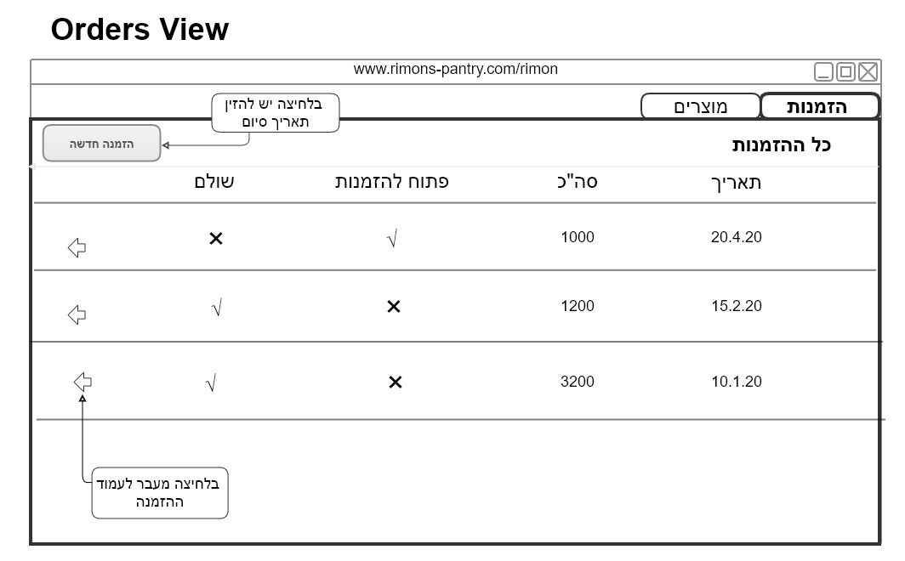
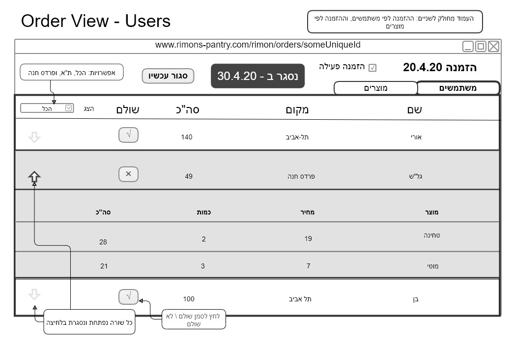
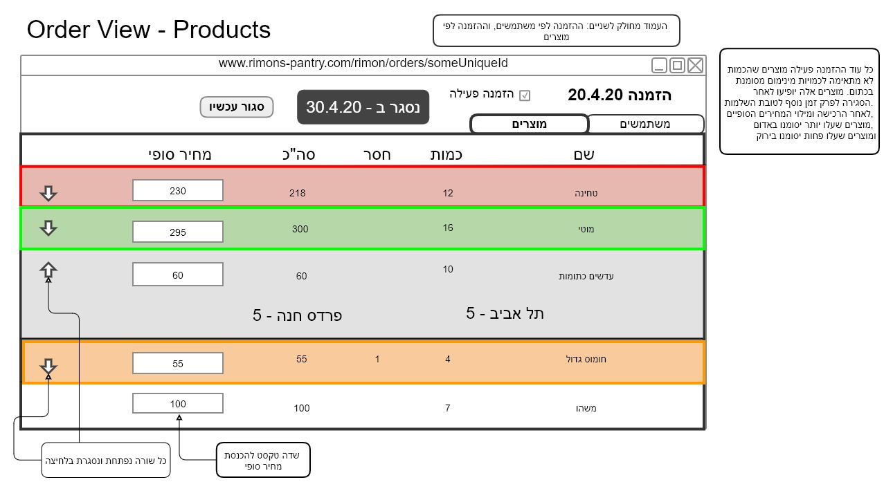

# Pomegranate Pantry
Let's help Elad help us shop for cheap!!

## Tech
- [React](https://reactjs.org/) ([Create-React-App](https://create-react-app.dev/)) - JavaScript UI framework by Facebook
- [Firebase](https://firebase.google.com/) -Backend as a service (BaaS) by Google

### Project type options
- Web App (only React and Firebase are needed)
- Progressive Web App (PWA - some mobile capabilities are available. Only React and Firebase are needed)
- Hybrid - cross platform (Web and a "native" mobile app. Some additional framework is needed, e.g [Ionic](https://ionicframework.com/))
- Mobile - cross platform (JavaScript generated native code base for both iOS and Android. Additional framework needed, e.g [React-Native](https://reactnative.dev/))

## Data Model

### Order
```ts
type OrderStatus = 'open' | 'completion' | 'shopping' | 'paying' | 'closed'

{
  status: OrderStatus,
  createdAt: Date,
  closingTime: Date,
  active: boolean,
  totalPrice: number | null, // total price of OrderUsers, null until OrderProduct.price is filled for every product in the order   
}

Order.totalPrice = userOrdres.reduce((acc, order) => acc += order.totalPrice, 0)
```

### OrderProduct
```ts
{ 
  [orderRef: string]: {
    [productRef: string]: {
      price: number
    }
  }, 
}
```

### User
```ts
{
  name: string,
  role: 'user' | 'rimon', // user is either a shopper or the one we now call Elad
  location: 'TA' | 'PH',
  email: string
}
```

### OrderUser
```ts
{
  userRef: string, // User's id
  orderRef: string, // Order's id
  products: OrderUserProducts[],
  totalPrice: number, // total price of products
  payed: boolean
}

totalPrice = products.reduce((acc, { product, qty }) => acc += product.price, 0)
```

#### OrderUserProducts
```ts
{
  [productRef: string]: qty // ref to OrderProduct
}
```

### Product
```ts
{
  name: string,
  price: number,
  minQty: number,
  qtyUnit: 'unit' | 'Kg'
}
```


## Client Interface

### User
```ts
{
  name: string,
  role: 'user' | 'rimon',
  location: 'TA' | 'PH',
  email: string,
  _id?: string;
}
```
### Order
```ts
type OrderStatus = 'open' | 'completion' | 'shopping' | 'paying' | 'closed';

{
  _id: string,
  active: boolean,
  status: OrderStatus,
  createdAt: Date,
  closingTime: Date,
  totalPrice: number, // total price of UsersOrders
  orderUsers: OrderUser[], // array of OrderUsers
  orderProducts: OrderProduct[], // array of OrderProducts
}
```

### OrderProduct 
```ts
{
  _id: string,
  productRef: string, // ref to Product
  orderRef: string, // ref to Order
  totalQty: number,
  missing: number | null,
  price: number,
}
```
### OrderUserProduct 
```ts
{
  productRef: string, // ref to Product
  qty: number
}
```

### OrderUser 
```ts
{
  _id?: string,
  products: OrderUserProduct[], // array of Products`
  userRef: string, // a ref to the user
  orderRef: string, // a ref to the order
  totalPrice: number | null, // total price of products.qty
  payed: boolean
}
```

### Product 
```ts
{
  name: string,
  minQty: number,
  qtyUnit: 'unit' | 'Kg',
  _id?: string
}
```

## State interface
### AuthState 
```ts
{
  loading: boolean,
  user: User | null,
  error: string | null
}
```

### AdminState
```ts
{
  loading: boolean,
  users: { [key: string]: User },
  orders: Order[],
  products: { [key: string]: Product },
  order: Order | null
}
```

### UserState
```ts
{
  loading: boolean,
  user: User | null,
  openOrder: Order | null,
  userOrders: OrderUser[],
  currentOrder: OrderUser | null,
  products: { [key: string ]: Product },
  orderProducts: OrderProduct[],
  error: string | null
}
```
## Views
### 1 Rimon Views
Rimon's main view is divided to Orders and Products using tabs.
#### 1.1 Orders View
A list of old orders, and the active one if it exists.

Clicking on an order's row leads to its [Order](#order_view)

#### 1.2 Products View
This is only needed for creating a fixed price for every product, and then compare it to the final price Elad types in manually.  
Maybe we omit the fixed prices and the users won't know the price until after the purchase (the way it is now...?). 

#### 1.3 Order View <a id="order_view"></a>
Every order view is divided to a list of the order's users, and a list of the order's products.

##### 1.3.1 Order Users View


##### 1.3.2 Order Products View


TODO: for every product with `Product.qytUnit === 'Kg'`, `OrderProduct.totalQty` has to satisfy the minimum quantity requirement for each location independently (or maybe just for PH?).

### 2 Users Views
_TODO_

## Login
- rimon@mail.com - testadmin
- testuser1@mail.com - rimontesting1
- yanir@ahmash.com = rimontesting2

## Run locally
- Clone and install dependencies:
    ```bash
    git clone https://github.com/OPerel/pomegranate_pantry.git
    cd pomegranate_pantry
    npm install
    ```

 - Ask me for the environment variables...  
Or start a new Firebase project and add a `.env` file at the root of the project with the Firebase configuration attached to these keys:
    ````
    REACT_APP_API_KEY=**********************
    REACT_APP_AUTH_DOMAIN=**********************
    REACT_APP_DATABASE_URL=**********************
    REACT_APP_PROJECT_ID=**********************
    REACT_APP_STORAGE_BUCKET=**********************
    REACT_APP_MESSAGING_SENDER_ID=**********************
    REACT_APP_APP_ID=**********************
    FIREBASE_TOKEN=*****************
    ````
   You can upload data to Realtime DB from `src/data/rimons-pantry-staging.json`.
- Run the dev server:
    ```bash
    npm run start
    ```
  
## Running tests
### Unit tests
In the project's folder run:
```bash
npm run test:unit
```

### E2E test
- Make sure the dev server is running on port 3000
- E2E tests require the Firebase emulator to be running.  
  You can run it just for the test run in one command:
    ```bash
    npm run test:e2e
    ```
- Or you can run the emulator permanently with:
    ```shell
    npm run emulators
    ```
- And then running the tests with:
    ```shell
    npm run cypress:run
    ```
- Or open the cypress GUI to run the tests from there with:
    ```shell
    npm run cypress:open
    ```
